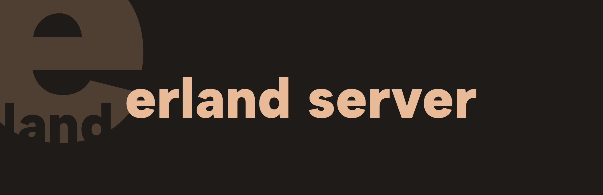

<div align="center">



# Erland

Self-hosted playground server for BEAM languages. Along with containerization, it offers a safe playground for you.

</div>

> ⚠️ You are currently viewing main branch ⚠️

For client implementation, take a look at [erland.ts](https://github.com/erland-beam/erland.ts). We already use it for our UI.

## Installation

> **STRONGLY** recommended to use it with Docker.

### Docker

Erland is already published on [Docker Hub](https://hub.docker.com/r/meppu/erland). You can pull the latest stable release like this:

```bash
docker pull meppu/erland
```

And use it:

```bash
docker run -p 8080:8080 meppu/erland -t
```

### Cargo

Erland is already published on [crates.io](https://crates.io/crates/erland). You must have install

```bash
cargo install erland
```

And use it:

```bash
erland --help
```

## Contributing

You can always report bugs and request features via [GitHub Issues](/issues).

For pull requests, make sure your code is well-formatted and at least can explain itself.

## License

Erland server is licensed under the AGPL-3.0 license.
